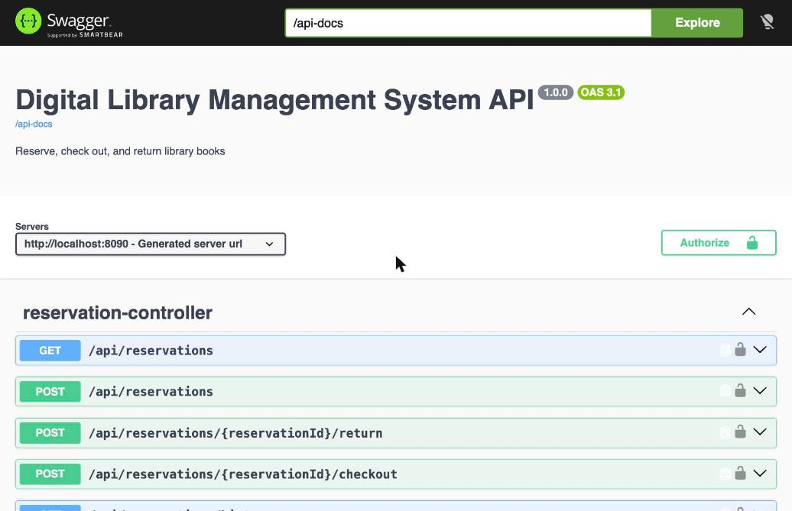
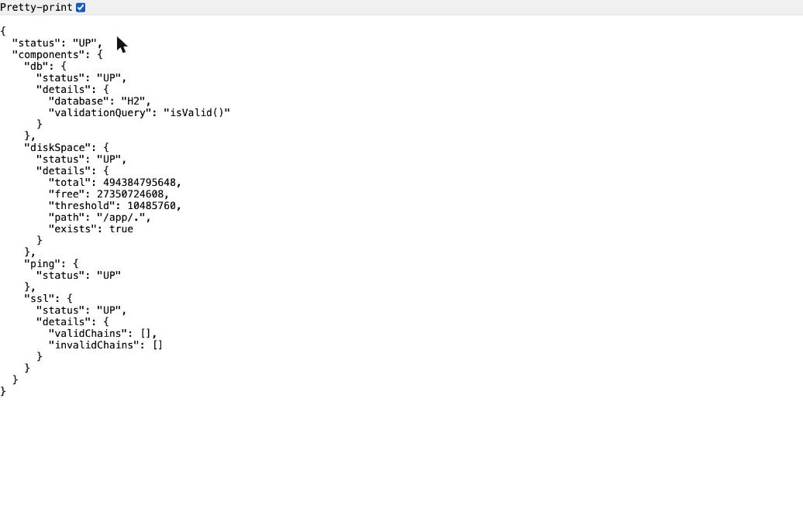
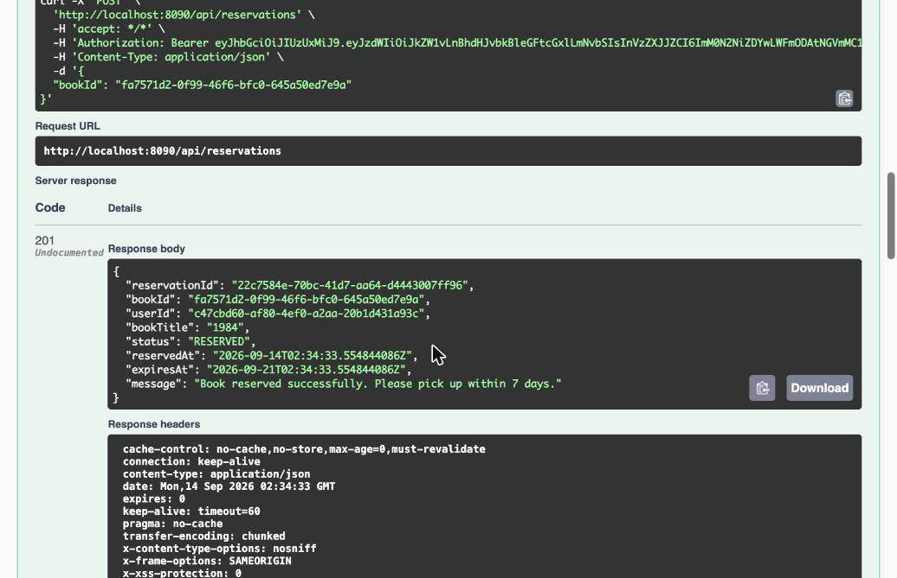
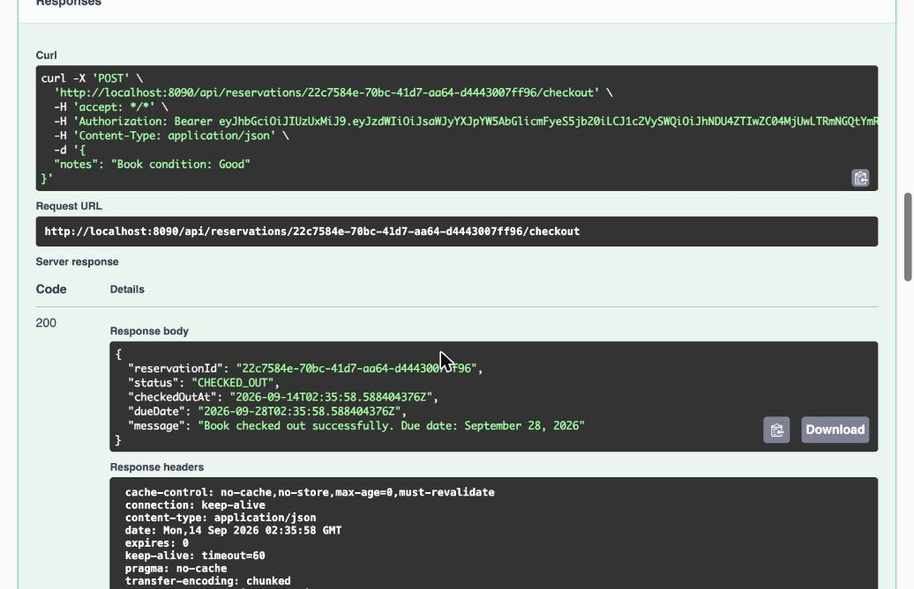
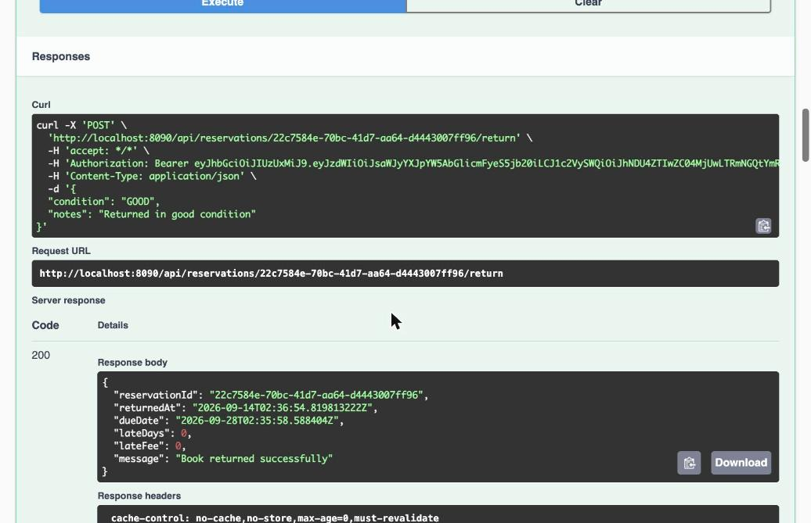

# Digital Library Management System API

A Spring Boot API for browsing a book catalog, reserving books, and managing checkouts/returns with JWT-based auth.

## Milestones

- **Milestone 1** — Data model: `User`, `Book`, and `Reservation` entities with JPA repositories.
- **Milestone 2** — Auth: registration, login, and JWT-secured profile endpoint.
- **Milestone 3** — Catalog: paginated book browsing with search and filters.
- **Milestone 4** — Reservations: reserve, checkout, return, and borrowing history with late fees.
- **Milestone 5** — Testing: unit and repository tests at 95.7% line coverage (enforced at 80% via JaCoCo).
- **Milestone 6** — Deployment: built and verified locally; not yet deployed to AWS (see below).

## Running locally

```bash
./mvnw spring-boot:run
```

Uses an in-memory H2 database (`dev` profile, the default) seeded with sample books and a librarian account (`librarian@library.com` / `Librarian123!`). App runs on port 8080. Swagger UI: `/swagger-ui.html`. Health check: `/actuator/health`.

## Design decisions and deviations from spec

- **Role promotion has no API endpoint.** Registration always creates a `PATRON` (per the contract). There's no public way to create a `LIBRARIAN` — that's a librarian-only operation in a real system, so it's handled by seeding one dev account and would be a direct database change in production, not an API surface.
- **Injected `Clock` instead of `Instant.now()`** in `ReservationService`, so reservation/due dates are deterministic and testable without relying on wall-clock time in tests.
- **Late fee calculation uses calendar-day difference**, not elapsed 24-hour periods — matches the contract's example (`dueDate` 15:00 to `returnedAt` next day 10:00 counts as 1 day late, not 0), which only makes sense as a calendar-date diff.
- **Errors are returned as flat JSON matching the contract exactly** (`error`, `message`, plus context fields like `currentReservations` or `currentStatus`), via a single `@RestControllerAdvice`.

## What was found and fixed

**In the starter code itself:**
- `application.properties` defaulted `spring.profiles.active` to `prod`, not `dev` — meaning a plain local run would silently load production-shaped config. Fixed to default to `dev`.
- The same JWT secret was hardcoded in both `application-dev.properties` and `application-prod.properties`, checked into source. Fixed: dev keeps a clearly-labeled dev-only fallback secret; prod now requires `JWT_SECRET` as an environment variable with no default (fails fast if unset).
- The prod datasource had a hardcoded fallback password (`RDS_PASSWORD:password`) and a leftover database name from a different project (`studentdb`). Fixed: no default password (forces the env var), corrected default database name.

**Found during my own build, fixed before calling it done:**
- `spring-boot-starter-actuator` was missing entirely, so `/actuator/health` — referenced throughout the docs and required for Milestone 6 — didn't exist. Added it.
- The global exception handler's catch-all was swallowing unexpected exceptions with no logging, making a 500 impossible to debug. Added logging before the generic response is returned.
- `springdoc-openapi` was pinned to a version incompatible with Spring Boot 3.5.6 (a `NoSuchMethodError` on `ControllerAdviceBean` broke `/api-docs` and Swagger UI entirely). Bumped to a compatible version.

## Above and beyond

None of the optional stretch items were attempted — effort went into a complete, correct baseline and closing the gaps above rather than extra scope.

## Proof it runs

Deployment to AWS (Milestone 6) is not done yet — the provided AWS account's IAM user doesn't have `rds:CreateDBInstance` permission, so RDS provisioning is blocked pending a permissions fix on that account. Everything below is from a local run of the actual packaged JAR (H2 database), not from tests.

**Swagger UI, live:**



**Green health check:**



**Full reserve → checkout → return flow, executed through Swagger UI:**

Reserve (201, patron token):


Checkout (200, librarian token):


Return (200, librarian token):

